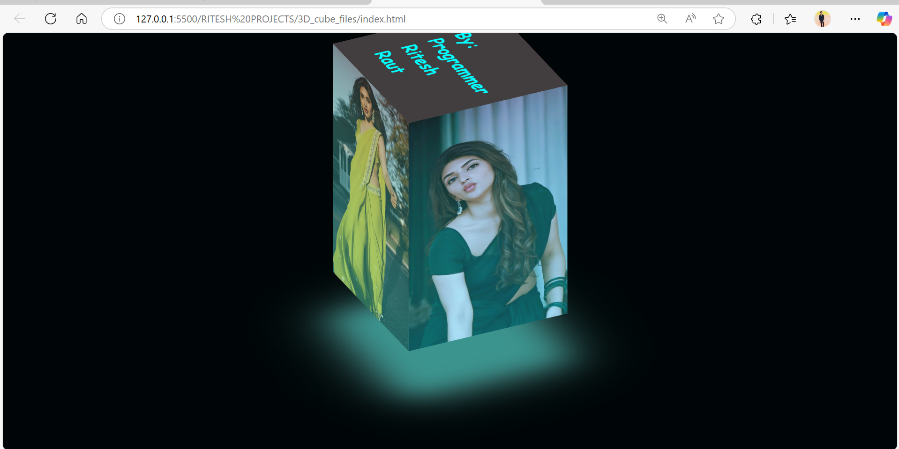

**# 🖼️ 3D Rotating Image Cube 🧊**

This project is a pure HTML and CSS implementation of a 3D rotating cube that serves as a visually engaging image gallery. The cube continuously rotates on its Y-axis, displaying different images on each of its four faces.
The current gallery features images of the actress **Sreeleela**.

---

## ✨ Features

*   **Pure CSS 3D Transform:** No JavaScript is used for the animation.
*   **Continuous Rotation:** The cube rotates smoothly in a 360-degree loop.
*   **Image Showcase:** Each of the four vertical faces of the cube displays a different image.
*   **Glow Effect:** A subtle glow effect is applied to the top face of the cube for added visual flair.
*   **Customizable:** Easily change the images or adjust the rotation speed and styling.

---

## 📸 3D Cube Homepage

---

## 🌐 Live Demo

[- 🔗 Click here to view the live site on Netlify](https://3dcubesreeleela.netlify.app/)

[- 🔗 Click here to view the live site on GitHub Pages](https://riteshraut0116.github.io/3D_Cube/)

---

## 📂 Repository Structure

3D_cube_files/                   # 📁 Folder containing assets for the 3D Cube
│
├── aria.jpg                     # 🖼️ Image used in the cube display
├── aria1.jpg                    # 🖼️ Additional image for cube rotation
├── aria2.jpg                    # 🖼️ Another image for cube face
├── aria3.jpg                    # 🖼️ Image for cube interaction
│
├── index.html                   # 🏠 Main webpage rendering the 3D Cube
├── screenshot.png               # 📸 Homepage preview of the 3D Cube
└── README.md                    # 📘 Project documentation and setup guide

---

## 🚀 How to Run

1.  Download or clone this repository to your local machine.
2.  Open the `index.html` file in any modern web browser (like Chrome, Firefox, or Edge).
3.  The 3D cube will immediately start rotating.

---

## 🛠️ Technical Details

The 3D effect is achieved entirely with CSS. Here's a brief breakdown:

*   **`transform-style: preserve-3d;`**: This property is applied to the `.cube-loader` and `.cube-wrapper` elements. It establishes a 3D rendering context, allowing child elements to be positioned in 3D space.
*   **`transform: rotateX(-30deg);`**: This gives the cube its initial isometric perspective.
*   **`@keyframes animate`**: This animation block controls the rotation. It animates the `transform` property from `rotateY(0)` to `rotateY(360deg)`, creating a full, seamless loop.
*   **`transform: rotateY(calc(90deg * var(--i))) translateZ(50px);`**: This is the key to positioning the four faces.
    *   `var(--i)` is a custom CSS variable set inline on each `` (from 0 to 3).
    *   `rotateY` positions each face around the center Y-axis at 90-degree increments (0°, 90°, 180°, 270°).
    *   `translateZ(50px)` pushes each face outward from the center, forming the sides of the cube. The `50px` value is half the cube's width.

---

## 💻 Technologies Used

*   **HTML5**
*   **CSS3**

---

## 👤 Author

**Ritesh Raut**  
*Programmer Analyst, Cognizant*

---

### 🌐 Connect with me:

---
